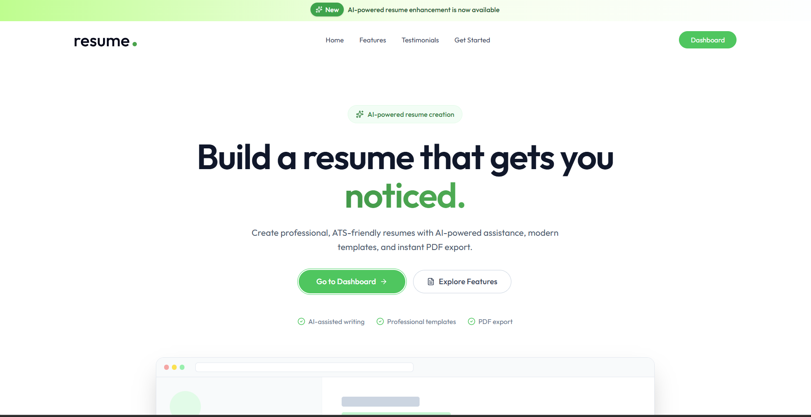
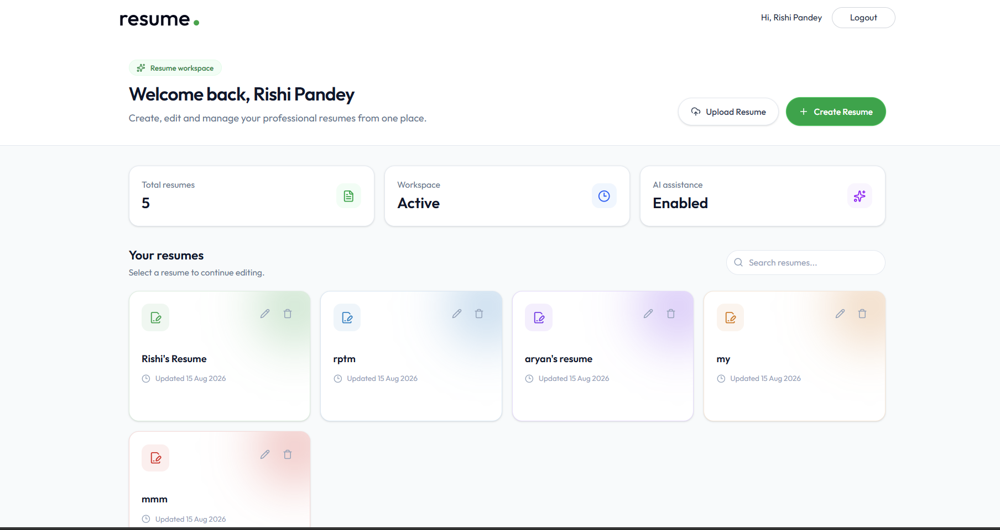
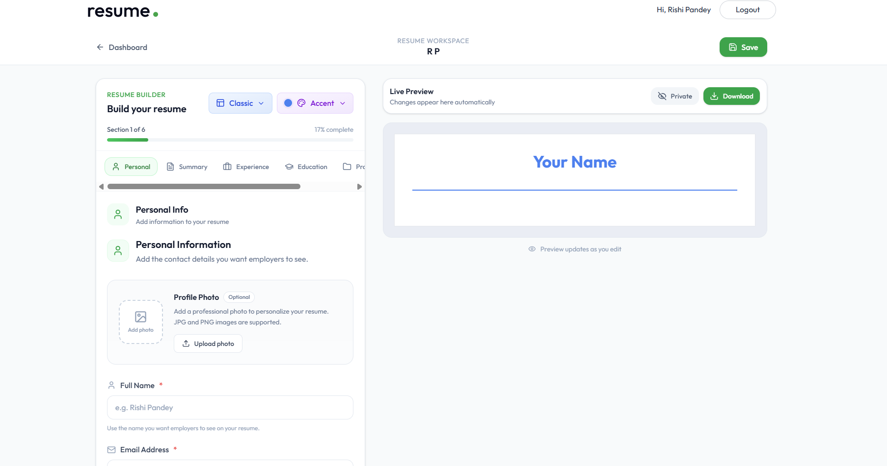
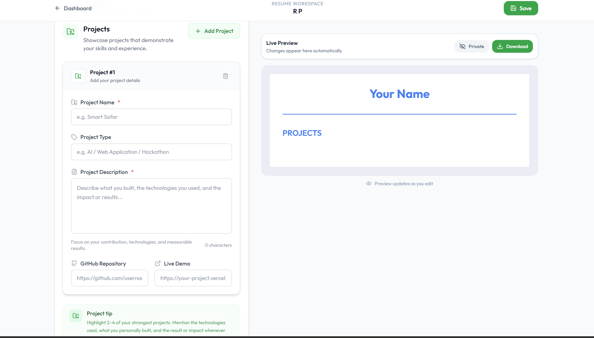
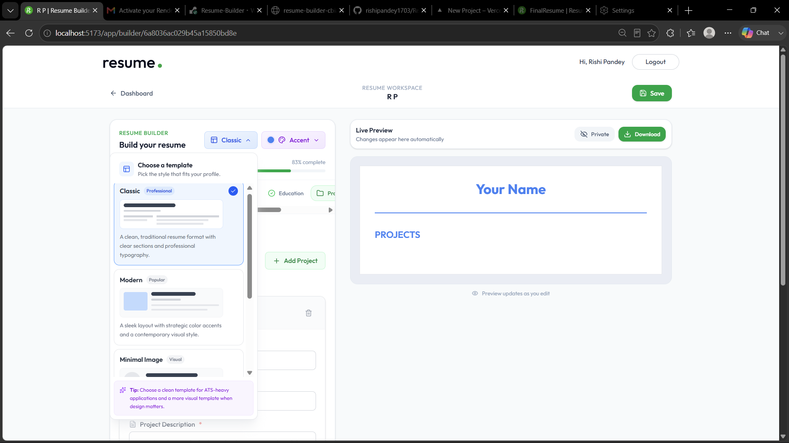
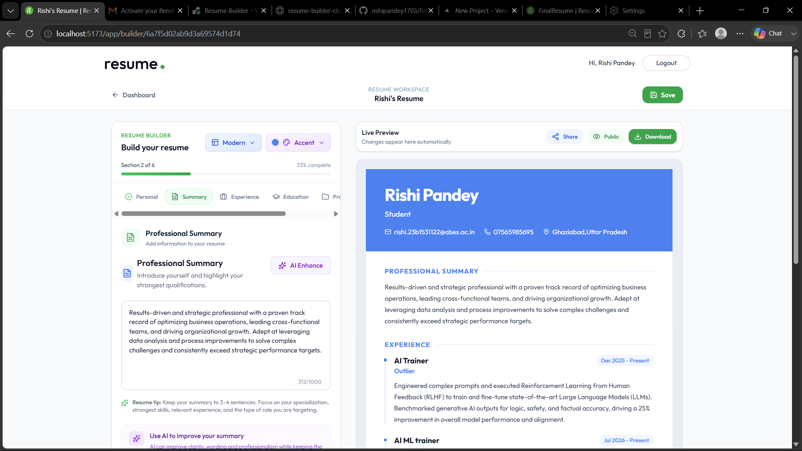

# Resume Builder

> **Build a professional resume. Improve it with AI. Customize it. Share it.**

A full-stack AI-powered Resume Builder that helps users create polished, ATS-friendly resumes through a guided editor, customizable templates, AI-assisted content improvement, project links, profile images, resume upload, and public sharing.

## ✨ Features

- 📝 Guided resume builder for Personal Info, Summary, Experience, Education, Projects and Skills
- 🤖 AI-assisted professional summary and job-description enhancement using Google Gemini
- 📄 Four resume templates: Classic, Modern, Minimal, Minimal Image
- 🎨 Customizable accent colors
- 🔗 GitHub Repository and Live Demo links for projects
- 🖼️ Profile image support with ImageKit
- 📥 PDF resume upload with text extraction and AI-assisted resume creation
- 🔐 JWT authentication with bcrypt password hashing
- 📊 Resume dashboard for creating, editing, renaming and deleting resumes
- 🌐 Public resume preview/sharing
- 🖨️ Print/PDF-friendly resume preview
- ⚡ Responsive React/Vite frontend with Express/MongoDB backend

## 🧠 What makes it different?

Resume Builder is designed as an **AI-assisted resume product**, not simply an AI text generator. The user remains in control of their actual information while AI helps improve clarity, professionalism and ATS-friendliness without inventing unsupported qualifications or achievements.

## 🛠️ Tech Stack

### Frontend
- React
- Vite
- React Router
- Redux Toolkit
- Axios
- Tailwind CSS
- Lucide React
- React Hot Toast

### Backend
- Node.js
- Express
- MongoDB
- Mongoose
- JWT
- bcrypt
- Multer
- CORS
- dotenv

### AI & Services
- Google Gemini / `@google/genai`
- ImageKit

## 🏗️ Architecture

```text
Browser
  │
  │ REST API
  ▼
React + Vite
  │
  ▼
Express + Node.js
  ├──────────────► MongoDB / Mongoose
  ├──────────────► Google Gemini
  └──────────────► ImageKit
```

## 📁 Project Structure

```text
resume-builder/
├── client/
│   ├── public/
│   └── src/
│       ├── app/
│       ├── assets/
│       ├── components/
│       │   ├── home/
│       │   └── templates/
│       ├── configs/
│       └── pages/
│
├── server/
│   ├── configs/
│   ├── controllers/
│   ├── middlewares/
│   ├── models/
│   ├── routes/
│   └── server.js
│
└── README.md
```

## 🔄 Application Flow

```text
Login / Register
      ↓
Dashboard
      ↓
Create / Upload Resume
      ↓
Edit Resume Sections
      ↓
AI Enhancement (optional)
      ↓
Choose Template + Accent Color
      ↓
Live Preview
      ↓
Save
      ↓
Preview / Print / Share
```

## 🤖 AI Workflow

```text
User Content
     ↓
AI Enhancement Request
     ↓
Google Gemini
     ↓
Improved Professional Content
     ↓
User Reviews / Edits
     ↓
Resume Preview
```

The AI prompts are designed to preserve the original meaning and avoid fabricating qualifications, companies, degrees, achievements or experience.

## 🔗 Project Links

Each project can contain:

- GitHub Repository
- Live Demo

Links are persisted with the resume and rendered as clickable links in the resume templates.

## 🔐 Environment Variables

### Client

Create `client/.env`:

```env
VITE_BASE_URL=http://localhost:3000
```

### Server

Create `server/.env`:

```env
MONGODB_URI=your_mongodb_connection_string
JWT_SECRET=your_jwt_secret
IMAGEKIT_PRIVATE_KEY=your_imagekit_private_key
GEMINI_API_KEY=your_gemini_api_key
CLIENT_URL=http://localhost:5173
```

> Never commit `.env` files or API keys to GitHub.

## 💻 Local Development

### 1. Clone

```bash
git clone https://github.com/rishipandey1703/Resume-Builder.git
cd Resume-Builder
```

### 2. Install frontend

```bash
cd client
npm install
```

### 3. Install backend

```bash
cd ../server
npm install
```

### 4. Configure environment variables

Create the `client/.env` and `server/.env` files shown above.

### 5. Start backend

```bash
cd server
npm run server
```

### 6. Start frontend

```bash
cd client
npm run dev
```

## 🌍 Deployment

The frontend and backend are deployed/configured independently.

### Frontend

Deploy the Vite client on Vercel and set:

```env
VITE_BASE_URL=<production-backend-url>
```

### Backend

Configure the production environment with:

```env
MONGODB_URI=<mongodb-uri>
JWT_SECRET=<jwt-secret>
IMAGEKIT_PRIVATE_KEY=<imagekit-private-key>
GEMINI_API_KEY=<gemini-api-key>
CLIENT_URL=<production-frontend-url>
```

After deployment, verify authentication, database access, AI endpoints, image uploads, resume saving, project links and public preview.

## 🧪 Production Checklist

- [ ] Registration and login
- [ ] Protected routes
- [ ] Resume creation/editing/deletion
- [ ] Resume persistence after refresh
- [ ] All four templates
- [ ] Accent colors
- [ ] AI enhancement
- [ ] PDF resume upload
- [ ] Profile image upload
- [ ] GitHub links
- [ ] Live Demo links
- [ ] Public resume preview
- [ ] Print/PDF output
- [ ] Production CORS
- [ ] No secrets committed

## 📸 Screenshots

### Landing Page

The landing page introduces the product and highlights AI-assisted resume creation, professional templates and PDF export.



### Resume Dashboard

A centralized workspace for creating, uploading, editing and managing multiple resumes.



### Resume Builder

The guided editor combines structured resume sections with a live preview, template selection and accent-color customization.



### Projects & Developer Links

Projects can include both a GitHub repository and a live demo, making it easy for recruiters to explore a candidate's work.



### Resume Templates

Users can switch between multiple professional layouts while keeping the same resume content.



### AI-Assisted Writing

The professional summary section includes AI enhancement to improve clarity, wording and professionalism while keeping the user's original information.



> The screenshots above show the application's main product flow: **discover → manage → build → enhance → customize → showcase**.

## 🔮 Future Improvements

- More professional templates
- Drag-and-drop section ordering
- ATS scoring and keyword analysis
- Job-description matching
- Multiple resume versions
- Additional export formats
- Custom shareable resume URLs
- Resume analytics
- More AI-assisted sections
- CI/CD automation

## 👨‍💻 Author

**Rishi Pandey**  
B.Tech CSE (AI & ML)

Interested in Artificial Intelligence, Machine Learning, Generative AI, Full-Stack Development and building practical software products.

## 🔗 Repository

https://github.com/rishipandey1703/Resume-Builder

## 📄 License

This project is licensed under the MIT License.

---

<div align="center">

### Built with React, Node.js, MongoDB & AI

**Create. Improve. Customize. Share.**

</div>
